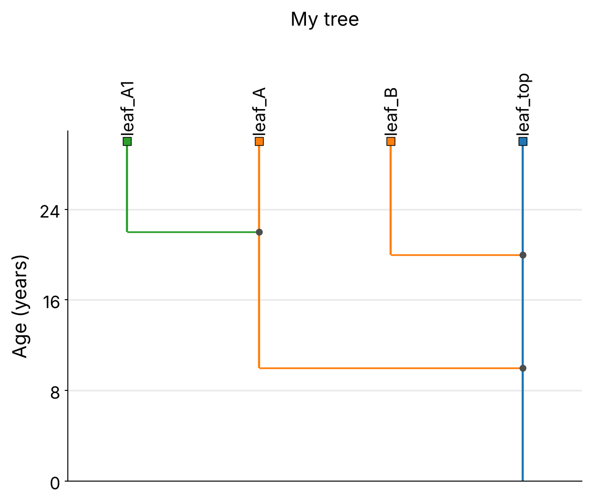
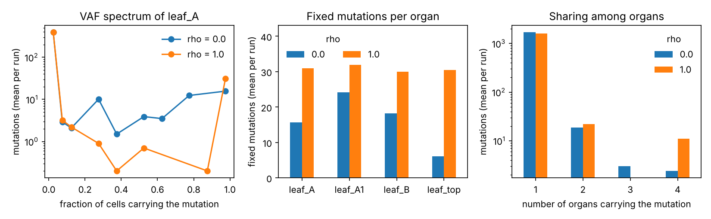
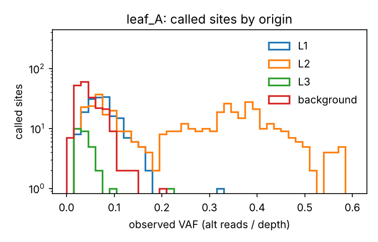

**simSOMA** simulates how somatic mutations arise in the stem cells of a shoot meristem and
spread through a branching plant. You describe the plant (its branches and the organs you
sample) and the developmental parameters; simSOMA returns, for every sampled organ, the
mutations it carries and at which variant allele frequency (VAF), and which mutations are
shared between organs.

This tutorial takes about **45 minutes**. You will:

1. install simSOMA and run a first simulation (10 min),
2. describe your own small tree and simulate it (15 min),
3. read and plot the results (10 min),
4. *optional:* turn simulated cells into sequencing reads, use a laser-scanned tree, and
   run larger parameter scans (10 min each).

Every command was tested with simSOMA 0.2.2 on Linux. Copy them into a terminal in the order
shown. Lines starting with `#` are comments.

> **What you need:** Linux or macOS, Python 3.10 or newer, and `git`. On Windows, use WSL
> (Windows Subsystem for Linux).

---

# Part 1 · Install and first run

## 1.1 Install

Download simSOMA and install it into its own Python environment:

```bash
cd ~                                   # or any folder you like
git clone https://github.com/jlab-code/simSOMA.git
cd simSOMA
python3 -m venv .venv                  # a private Python environment for simSOMA
source .venv/bin/activate              # switch it on
pip install .                          # install simSOMA and its dependencies
simsoma version
```

You should see something like this (`plantsoma_obs` is simSOMA's sequencing-read model):

```text
{
  "simsoma": "0.2.2",
  "plantsoma_obs": "1.1.0",
  ...
}
```

> **Every new terminal:** go to the `simSOMA` folder and switch the environment on again with
> `source .venv/bin/activate`. If the command `simsoma` is "not found", this is the reason.

## 1.2 Your first simulation

simSOMA ships with a tiny test plant: a trunk with one side branch and two sampled leaves.

```bash
simsoma run simSOMA_configs/quick_test_2organs.json
```

This takes a few seconds and does two things:

1. **check**: reads the plant description, checks it, and draws it;
2. **run**: simulates the cell lineages and writes result tables.

Everything goes into one folder per experiment:

```text
simSOMA_output/quick_test_2organs/
├── config_used.json          # exact settings of this run
├── software_version.json     # simSOMA version used
├── topology_check/           # picture of the plant (topology_phylogram_original_units.png)
└── grid_parameter/           # the results (tables, see Part 3)
```

Each run reads one settings file and writes one result folder. The rest of the tutorial
shows how to write the settings for your own plant.

---

# Part 2 · Simulate your own tree

We simulate a small 30-year-old tree with a trunk, two branches and one twig, and sample
one leaf at the end of each:

{width=55%}

Make a folder for your project inside the `simSOMA` folder:

```bash
cd ~/simSOMA
mkdir -p my_project
```

Parts 2 and 3 simulate one stem-cell layer of the meristem; section 4.1 simulates the
layers L1, L2 and L3 separately.

## 2.1 Describe the plant with two small tables

The easiest way to describe a plant is two CSV tables (you can write them in a spreadsheet
and save as CSV).

> **Creating files.** Commands of the form `cat > FILE <<'EOF' ... EOF` create the file
> `FILE` with the lines in between. You can instead paste those lines into a text editor and
> save the file under that name.

**Branches**: one row per branch, with the year (or position) where it starts and ends.
The trunk has no parent.

```bash
cat > my_project/branches.csv <<'EOF'
branch_id,parent_id,start,end
trunk,,0,30
branch_A,trunk,10,30
branch_B,trunk,20,30
twig_A1,branch_A,22,30
EOF
```

**Organs**: one row per sampled organ (leaf, fruit, flower, ...), with the branch it sits
on and its position.

```bash
cat > my_project/organs.csv <<'EOF'
organ_id,branch_id,position
leaf_top,trunk,30
leaf_A,branch_A,30
leaf_A1,twig_A1,30
leaf_B,branch_B,30
EOF
```

Convert the two tables into the plant file simSOMA reads (a "topology" in JSON format):

```bash
simsoma topology-from-csv my_project/branches.csv my_project/organs.csv my_project/my_tree.json --unit years
```

```text
Wrote topology JSON: my_project/my_tree.json
Branches: 4 | Organs: 4 | Events: 7 | Root: trunk
```

> **Units.** All positions are measured from the base of the plant: either plant age in
> `years`, or path length from the stem base in `meters`. Use one unit throughout. Here,
> `branch_A` grew out of the trunk in year 10, and `twig_A1` grew out of `branch_A` in
> year 22.

## 2.2 Write the settings file

The settings file ("config") tells simSOMA which plant to use, the developmental
parameters, and how many simulations to run. Create it:

```bash
cat > my_project/my_config.json <<'EOF'
{
  "run": {
    "experiment_name": "my_tree_rho",
    "outdir_root": "simSOMA_output",
    "seed": 1
  },
  "topology": {
    "topology_json": "my_tree.json",
    "mapping_unit": "years",
    "mapping_rate": 5.0
  },
  "check": {
    "topology_plot": {"show_tip_labels": true, "title": "My tree"}
  },
  "simulation": {
    "n_sim": 10,
    "modules": {
      "self_renewal": {
        "m": 4,
        "rho": {"values": [0.0, 1.0]},
        "mu_unit": 1.0,
        "victim_locality": 0.0,
        "bias_mode": "fixed",
        "branch_bias_value": 0.0,
        "branch_bias_mean": 0.0,
        "branch_bias_kappa": 1.0
      },
      "pre_branching": {"sam_boundary_cells": 40},
      "branching": {"branch_precursor_number": 4},
      "organ": {
        "organ_precursor_number": 8,
        "organ_total_cells": 1000,
        "seq_fraction": 1.0
      }
    }
  }
}
EOF
```

What the parts mean:

| Block | Setting | Meaning |
|---|---|---|
| `run` | `experiment_name` | name of the result folder |
| | `outdir_root` | where result folders go (`simSOMA_output` = the `simSOMA_output` folder inside `simSOMA`) |
| | `seed` | random seed; the same seed gives the same results |
| `topology` | `topology_json` | the plant file (path relative to the folder of this settings file) |
| | `mapping_unit` | unit of the plant file: `years` or `meters` |
| | `mapping_rate` | stem-cell divisions (self-renewal rounds) per year or per meter (κ) |
| `check` | `topology_plot` | optional drawing options (here: show organ names, add a title) |
| `simulation` | `n_sim` | number of independent simulations per parameter setting |
| | `modules` | developmental parameters, explained in the table below |

The developmental parameters (symbols as in the simSOMA paper):

| Parameter | Symbol | Meaning | Value here |
|---|---|---|---|
| `m` | m | number of stem cells in the meristem (per layer) | 4 |
| `rho` | ρ | stem-cell turnover: chance per division round that one stem cell is replaced by the daughter of another | 0 and 1 |
| `mu_unit` | μ | mutations per cell lineage per year (or meter) | 1 |
| `sam_boundary_cells` | C | cells at the meristem edge from which new branches and organs are recruited | 40 |
| `branch_precursor_number` | P~b~ | cells that found a new branch meristem | 4 |
| `organ_precursor_number` | P~o~ | cells that found an organ | 8 |
| `organ_total_cells` | O | cells in the grown organ | 1000 |
| `seq_fraction` |  | fraction of organ cells that are sampled for the output | 1.0 (all) |
| `victim_locality`, `bias_mode`, `branch_bias_*` |  | advanced options for stem-cell competition; leave as shown | |

**Fixed value or scan.** Write a single number to fix a parameter (`"m": 4`). Write a list
to compare several values (`"rho": {"values": [0.0, 1.0]}`). simSOMA runs every combination
of all listed values, each `n_sim` times. Here: 2 values of ρ × 10 simulations.

> **Mutation rate.** `mu_unit` counts mutations per *cell lineage* per year (or meter). For a
> rate μ~bp~ per base pair per year (or meter) and a diploid genome of G base pairs, set
> `mu_unit = 2 × G × μ_bp`. A relative value such as 1 is fine for exploring: the shape of the
> VAF spectrum does not depend on it, only the number of mutations.

## 2.3 Check the plant, then run

Draw the plant first and look at the picture:

```bash
simsoma check my_project/my_config.json
```

The picture is `simSOMA_output/my_tree_rho/topology_check/topology_phylogram_original_units.png`
(the figure at the top of Part 2). Check that branches and leaves are where you expect them.
Then simulate:

```bash
simsoma run my_project/my_config.json
```

This takes about 10 seconds and ends with `n_parameter_sets: 2` (the two values of ρ).

> **Changed the settings?** simSOMA protects existing results: if you edit the settings and
> run again with the same `experiment_name`, it stops with "Run directory already exists with
> a different config". Choose a new `experiment_name`, or delete the old folder
> (`rm -r simSOMA_output/my_tree_rho`).

---

# Part 3 · Read and plot the results

## 3.1 The result tables

All tables are in `simSOMA_output/my_tree_rho/grid_parameter/`. Each row carries the
parameter values it belongs to, so you can filter by `rho`, `m`, and so on.

> **VAF in Parts 2 and 3** is the fraction of sampled cells that carry a mutation (column
> `sampled_vaf`). In sequencing reads, a heterozygous mutation in a diploid genome shows half
> of that; section 4.1 adds this step.

| File | One row per | Use it for |
|---|---|---|
| `parameter_sets.csv` | parameter setting | which settings were simulated (`set_id`) |
| `vaf_count_spectrum_aggregated_summaries.csv` | setting × organ × allele count | **VAF spectra**: how many mutations at each VAF |
| `organ_aggregated_summaries.csv` | setting × organ | mutations per organ: total, fixed (in all sampled cells), singletons (in one cell only) |
| `sharing_aggregated_summaries.csv` | setting × statistic | which mutations are shared between organs |
| `aggregated_summaries.csv` | setting | whole-plant totals |
| `*_replicate_summaries.*` | the same, per single simulation | spread between simulations |

"aggregated" tables give the mean (`_mean`) and standard deviation (`_sd`) over the `n_sim`
simulations.

## 3.2 Plot the results

Save this script and run it on the result folder. You do not need to understand it to use
it; pandas and matplotlib were installed with simSOMA.

```bash
cat > my_project/plot_results.py <<'EOF'
"""Plot the main simSOMA results of one run: VAF spectrum, fixed mutations, sharing.
Usage: python plot_results.py simSOMA_output/my_tree_rho
"""
import sys
from pathlib import Path

import matplotlib
matplotlib.use("Agg")
import matplotlib.pyplot as plt
import numpy as np
import pandas as pd

run = Path(sys.argv[1])
out = run / "grid_parameter"
spec = pd.read_csv(out / "vaf_count_spectrum_aggregated_summaries.csv")
organs = pd.read_csv(out / "organ_aggregated_summaries.csv")
sharing = pd.read_csv(out / "sharing_aggregated_summaries.csv")
param = "rho"                                   # the parameter that was scanned

fig, ax = plt.subplots(1, 3, figsize=(11, 3.4))

# A: VAF spectrum of one organ (mutations binned by VAF)
organ = sorted(spec["organ_id"].dropna().unique())[0]
bins = np.linspace(0, 1, 21)
for value, d in spec[(spec.level == "organ") & (spec.variant_class == "all")
                     & (spec.organ_id == organ)].groupby(param):
    counts, _ = np.histogram(d.sampled_vaf, bins=bins, weights=d.n_variants_mean)
    mid = (bins[:-1] + bins[1:]) / 2
    keep = counts > 0
    ax[0].plot(mid[keep], counts[keep], marker="o", label=f"{param} = {value}")
ax[0].set_yscale("log")
ax[0].set_xlabel("fraction of cells carrying the mutation")
ax[0].set_ylabel("mutations (mean per run)")
ax[0].set_title(f"VAF spectrum of {organ}")
ax[0].legend(frameon=False)

# B: fixed mutations (present in all sequenced cells) per organ
tab = organs.pivot(index="organ_id", columns=param, values="fixed_mean")
tab.plot.bar(ax=ax[1], rot=0)
ax[1].set_ylabel("fixed mutations (mean per run)")
ax[1].set_xlabel("")
ax[1].set_title("Fixed mutations per organ")
ax[1].set_ylim(0, tab.values.max() * 1.35)
ax[1].legend(title=param, frameon=False, loc="upper left", ncol=2)

# C: how many organs share each mutation
deg = sharing[sharing.statistic == "sharing_degree"].pivot(
    index="sharing_degree", columns=param, values="n_variants_mean")
deg.index = deg.index.astype(int)
deg.plot.bar(ax=ax[2], rot=0, logy=True)
ax[2].set_xlabel("number of organs carrying the mutation")
ax[2].set_ylabel("mutations (mean per run)")
ax[2].set_title("Sharing among organs")
ax[2].legend(title=param, frameon=False, loc="upper right")

fig.tight_layout()
target = run / "results_overview.png"
fig.savefig(target, dpi=150)
print(f"Wrote {target}")
EOF
python3 my_project/plot_results.py simSOMA_output/my_tree_rho
```

Panel A shows the first organ in alphabetical order (`leaf_A`); to show another, replace
`[0]` in the line `organ = sorted(...)[0]` by `[1]`, `[2]`, ...



How to read the three panels:

* **A, VAF spectrum.** Most mutations are carried by few cells of the leaf. They arose
  while the leaf grew from its 8 founder cells to 1000 cells, or in only some of those
  founder cells. Mutations at 1 are **fixed**: every sampled cell of the leaf carries them.
* **B, fixed mutations.** Stem-cell turnover (ρ = 1) lets single stem-cell lineages take
  over the meristem, so more mutations become fixed.
* **C, sharing.** Mutations carried by several leaves arose in a shared part of the tree.
  Mutations found in all four leaves arose in the trunk meristem before the first branch and
  were passed into every branch. Turnover increases their number.

With the same settings and seed, your numbers should be identical (tested with simSOMA 0.2.1 and 0.2.2).

## 3.3 Summary statistics (optional)

This script condenses each organ's spectrum into the four summary statistics of the
simSOMA paper: the fractions of fixed, intermediate-frequency and private (found in this
organ only) mutations, and how widely mutations are shared:

```bash
bash simSOMA_scripts/run_extract_formula_statistics.sh simSOMA_output/my_tree_rho
```

The figure-ready table is
`simSOMA_output/my_tree_rho/grid_parameter/formula_statistics_tables/parameter_set_formula_statistics_summary.tsv`
(one row per parameter setting and statistic; `organ_mean` and `organ_sd` across organs).
`statistic_definitions.tsv` in the same folder defines each statistic, including the VAF
thresholds used.

---

# Part 4 · Going further

## 4.1 From cells to sequencing reads

The simulation in Part 2 gives the *true* fraction of cells carrying each mutation. Real
data are reads from a bulk tissue sample, and plant organs are built from several
cell layers (L1, L2, L3) that grow from separate stem cells. `simsoma layers` simulates each
layer as its own cell lineage, mixes the layers in each organ sample, and draws sequencing
reads.

Create its settings file (`simsoma template layered` prints a template with all options):

```bash
cat > my_project/my_layers.json <<'EOF'
{
  "topology": {
    "topology_json": "my_tree.json",
    "mapping_unit": "years",
    "mapping_rate": 5.0
  },
  "simulation": {
    "seed": 0,
    "n_replicates": 2,
    "parameters": {
      "m": 4, "rho": 0.0,
      "sam_boundary_cells": 40, "branch_precursor_number": 4,
      "organ_precursor_number": 8, "organ_total_cells": 1000, "sequenced_cells": 1000,
      "organ_mu_multiplier": 1.0
    },
    "layers": {
      "L1": {"mu_unit": 10.0},
      "L2": {"mu_unit": 10.0},
      "L3": {"mu_unit": 10.0}
    }
  },
  "observation": {
    "phase": "unphased",
    "layer_contributions": {"L1": 0.3, "L2": 0.6, "L3": 0.1},
    "model": {
      "depth": {"mode": "lognormal_site_sample", "mean": 60},
      "reads": {"type": "binomial", "sequencing_error": 0.0},
      "background": {"n_sites": 500, "distribution": "gamma:2", "mean": 0.023},
      "caller": {"min_depth": 0, "min_alt_reads": 2, "retain_called_any": true}
    },
    "vafsoma_tables": {"first_cut_fraction": 0.5, "n_tiers": 4}
  },
  "output": {"dir": "simSOMA_output/my_tree_layers"}
}
EOF
simsoma layers my_project/my_layers.json
```

The developmental parameters are the same as in Part 2 (here with ρ = 0), written as single
values. `n_replicates` is the number of simulations, and `sequenced_cells` the number of
sampled cells per organ. We use `mu_unit = 10` so that each leaf has enough mutations to
see the layer pattern below.

The main settings of `my_project/my_layers.json` (open it in a text editor):

| Setting | Meaning |
|---|---|
| `simulation.layers` | the layers and their mutation rates `mu_unit` |
| `observation.layer_contributions` | share of each layer's cells in the sampled tissue (sums to 1; example values) |
| `observation.phase` | `unphased`: reads of both chromosome copies pooled, so a heterozygous mutation gives VAF ≤ 0.5; `phased`: reads assigned to one copy |
| `observation.model.depth` | sequencing depth (mean 60; varies between sites and samples) |
| `observation.model.caller` | when a mutation counts as detected (e.g. at least 2 reads) |
| `observation.model.background` | false-positive sites (sequencing or mapping artefacts) with a low VAF in every sample |

**Choosing layer mixtures.** All layer settings are yours to choose: which layers to
simulate, their mutation rates, and how much each layer contributes to a sample. Organs can
differ, for example a leaf dominated by L2 and a fruit with a large L3 share. Give one mixture
per organ, plus a `default` for all organs not listed:

```json
"layer_contributions": {
  "leaf_top": {"L1": 0.2, "L2": 0.7, "L3": 0.1},
  "default":  {"L1": 0.3, "L2": 0.6, "L3": 0.1}
}
```

Each mixture must sum to 1. The template's values (L1 0.13, L2 0.84, L3 0.03) are the mean of
published leaf compositions; sources and details are in `simSOMA_docs/layered_simulation.md` in
the simSOMA repository. This tutorial uses L1 0.3, L2 0.6, L3 0.1 instead, so that the L1 and
L3 mutations stand out from the background in the figure.

Each replicate folder (`simSOMA_output/my_tree_layers/replicate_0000/`) contains:

| File | Content |
|---|---|
| `layer_carriers.csv.gz` | true carrier fraction of every mutation in every organ, per layer |
| `read_evidence.csv.gz` | depth, alternative reads, observed VAF, and whether the site was called |
| `vafsoma_dp_*_vaf.csv` | the same reads as input tables for the vafSOMA mutation-rate estimator |

Plot the called (detected) mutations of one leaf by the layer they arose in:

```bash
cat > my_project/plot_layers.py <<'EOF'
"""VAF of called mutations in one leaf, coloured by the layer they arose in.
Usage: python plot_layers.py simSOMA_output/my_tree_layers leaf_A
"""
import sys
from pathlib import Path

import matplotlib
matplotlib.use("Agg")
import matplotlib.pyplot as plt
import pandas as pd

run, organ = Path(sys.argv[1]), sys.argv[2]
ev = pd.read_csv(run / "replicate_0000" / "read_evidence.csv.gz")
called = ev[(ev.organ_id == organ) & ev.called]

fig, ax = plt.subplots(figsize=(5, 3.2))
for layer, d in called.groupby("site_layer"):
    ax.hist(d.observed_vaf, bins=40, range=(0, 0.6), histtype="step", lw=1.6, label=layer)
ax.set_xlabel("observed VAF (alt reads / depth)")
ax.set_ylabel("called sites")
ax.set_yscale("log")
ax.set_title(f"{organ}: called sites by origin")
ax.legend(frameon=False)
fig.tight_layout()
target = run / f"called_vaf_{organ}.png"
fig.savefig(target, dpi=150)
print(f"Wrote {target}")
EOF
python3 my_project/plot_layers.py simSOMA_output/my_tree_layers leaf_A
```

{width=60%}

A mutation fixed in L2 is carried by 60% of the sampled cells and, being heterozygous,
by half of their DNA copies, so it appears at VAF ≈ 0.6 × 0.5 = 0.3. Fixed L1 mutations
appear at about 0.15, where they are easy to confuse with L2 mutations carried by only part
of the leaf; fixed L3 mutations (≈ 0.05) fall among the background artefacts. Layer
composition therefore matters when mutations are counted in bulk samples.

> **Using the main workflow instead.** A settings file for `simsoma run` can also carry an
> `observation_model` block, which converts the result tables to observed VAFs and can export
> read counts for fitSOMA. See `simSOMA_docs/observation_model_config.md` in the repository.

## 4.2 Trees from terrestrial laser scans

A tree measured with a terrestrial laser scanner and reconstructed with TreeQSM (software
that fits cylinders to the scan and returns the branching structure) can be used directly. simSOMA reads the TreeQSM segment table (columns `segment`, `parent_segment`,
`branch_order`, `length_m`, `base_distance_m`; one row per segment), merges segments into
branches, and samples an organ at the tip of every branch. In the settings file, replace
`topology_json` by `topology_tls`:

```text
"topology": {
  "topology_tls": {"segments": "my_tree_segments.txt", "organs": "all"},
  "mapping_unit": "meters",
  "mapping_rate": 5.0
}
```

* `organs`: `"all"` tips, `"random:200"` (200 random tips), `"min_order:3"` (tips of
  branches of order 3 or higher; the trunk has order 0, its branches order 1, and so on), or a
  list of tip segment IDs.
* `mapping_rate` is now the number of stem-cell division rounds per **meter** of growth.

The repository contains a small synthetic example. Run it:

```bash
simsoma run simSOMA_configs/example_tls_tree.json
```

```text
topology_tls: 17 organs, 17 branches -> .../simSOMA_output/tls_tree_example/topology_input/topology_from_tls.json
```

The converted tree and a conversion report are saved in `topology_input/` of the result
folder. Whole tree crowns have 10^4^ or more tips; start with `"organs": "random:50"` to see
how long a run takes. `simsoma topology-from-tls` converts a segment table without running
a simulation (for example to use it with `simsoma layers`). Details:
`simSOMA_docs/tls_topology.md`.

## 4.3 Larger runs

Parameter scans grow quickly: three values each of four parameters are already 81 settings.
Split them over several processor cores. As an example, scan three stem-cell numbers m. The
first command copies your settings file and changes two lines (the experiment name, and
`"m": 4` to a list of values); you could also make these edits in a text editor. The
second command runs the scan on 3 cores:

```bash
sed -e 's/"my_tree_rho"/"my_tree_m_scan"/' -e 's/"m": 4/"m": {"values": [2, 4, 8]}/' \
    my_project/my_config.json > my_project/my_config_m_scan.json
simsoma run my_project/my_config_m_scan.json --splits 3 --jobs 3
```

The split results are merged into one `grid_parameter/` folder as before; the per-split
folders (`my_tree_m_scan__psplit_*`) can be deleted afterwards. On a remote
server, start long runs so that they continue after you log out, and follow the log file
(replace the file names with your own):

```bash
nohup simsoma run my_project/big_config.json --splits 20 --jobs 20 > big_run.log 2>&1 &
tail -f big_run.log
```

Run time grows with the number of sampled organs, `organ_total_cells`, the plant size × κ,
and `n_sim`. Try your settings with `n_sim` = 2 first.

---

# Reference

## Commands

| Command | Does |
|---|---|
| `simsoma run CONFIG` | check the plant, then simulate (add `--splits N --jobs J` for parallel runs) |
| `simsoma check CONFIG` | only check and draw the plant |
| `simsoma layers CONFIG` | per-layer simulation with sequencing reads |
| `simsoma topology-from-csv BRANCHES.csv ORGANS.csv OUT.json --unit years` | build a plant file from two tables |
| `simsoma topology-from-tls SEGMENTS.txt OUT.json --organs all` | build a plant file from a TreeQSM table |
| `simsoma template layered` | print a settings template for `simsoma layers` |
| `simsoma version` | show the installed version |

## Plant file (topology JSON)

`simsoma topology-from-csv` writes this file for you, but you can also write it by hand.
Branches have an `id`, a `parent` (`null` for the trunk) and a `length`; events place
branches and organs on their parent branch at a relative position `pos` from 0 (base) to
1 (tip):

```json
{
  "unit": "years",
  "branches": [
    {"id": "trunk",    "parent": null,    "length": 30},
    {"id": "branch_A", "parent": "trunk", "length": 20}
  ],
  "events": [
    {"branch": "trunk",    "pos": 0.333, "type": "branch", "target": "branch_A"},
    {"branch": "trunk",    "pos": 1.0,   "type": "organ",  "target": "leaf_top"},
    {"branch": "branch_A", "pos": 1.0,   "type": "organ",  "target": "leaf_A"}
  ]
}
```

Organs can also sit along a branch (`pos` < 1), for example several leaves on one shoot.

## Troubleshooting

| Problem | Solution |
|---|---|
| `simsoma: command not found` | switch the environment on: `cd simSOMA` then `source .venv/bin/activate` |
| `pip install .` fails | check `python3 --version` (3.10 or newer needed); update pip with `pip install --upgrade pip` |
| `topology.topology_json not found` | paths in a settings file are relative to the settings file's own folder |
| `Run directory already exists with a different config` | new `experiment_name`, or delete the old result folder |
| `Missing required parameters in simulation.modules...` | every parameter in the table of section 2.2 must be present |
| A run takes very long | reduce `n_sim`, `organ_total_cells` or the number of organs; use `--splits`/`--jobs` |

## Citing

If you use simSOMA, please cite the paper, *simSOMA: a cell-lineage based simulator of the
somatic VAF spectrum in plants* (bioRxiv 2026,
[doi:10.64898/2026.06.28.735079](https://doi.org/10.64898/2026.06.28.735079)), and the
software version you used (`simsoma version`).
